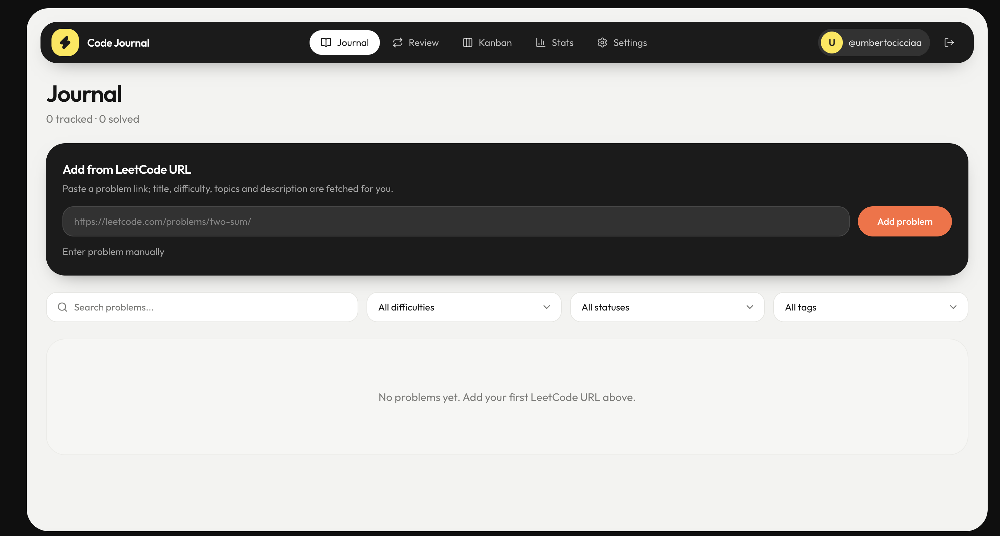

# Code Journal

LeetCode/Neetcode journal with shared problem library, spaced repetition (Leitner), kanban reviews, markdown notes, and public stats.

## Features

- **Shared library**: LeetCode/Neetcode problems are stored once; each user keeps their own journal entries
- **Add by URL**: Paste a LeetCode/Neetcode link; falls back to manual entry if fetch fails
- **Markdown**: Problem descriptions, notes, and solutions support markdown
- **Leitner review**: `/review` queue with active recall
- **Kanban**: Drag cards between Leitner boxes at `/kanban`
- **Stats**: Heatmap, streaks, charts at `/stats`
- **Public profiles**: `/u/[username]` when `statsPublic` is enabled
- **LeetCode/Neetcode Premium cookies**: Optional encrypted credentials in Settings for company tags
